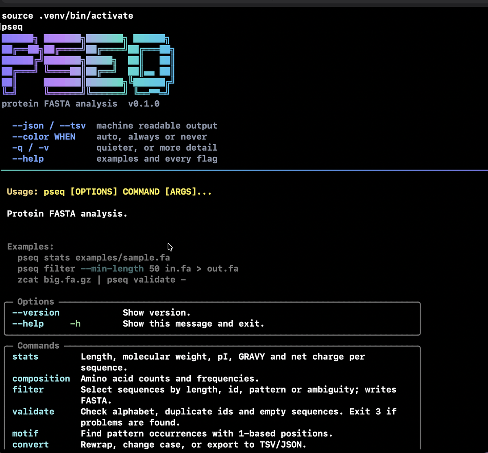
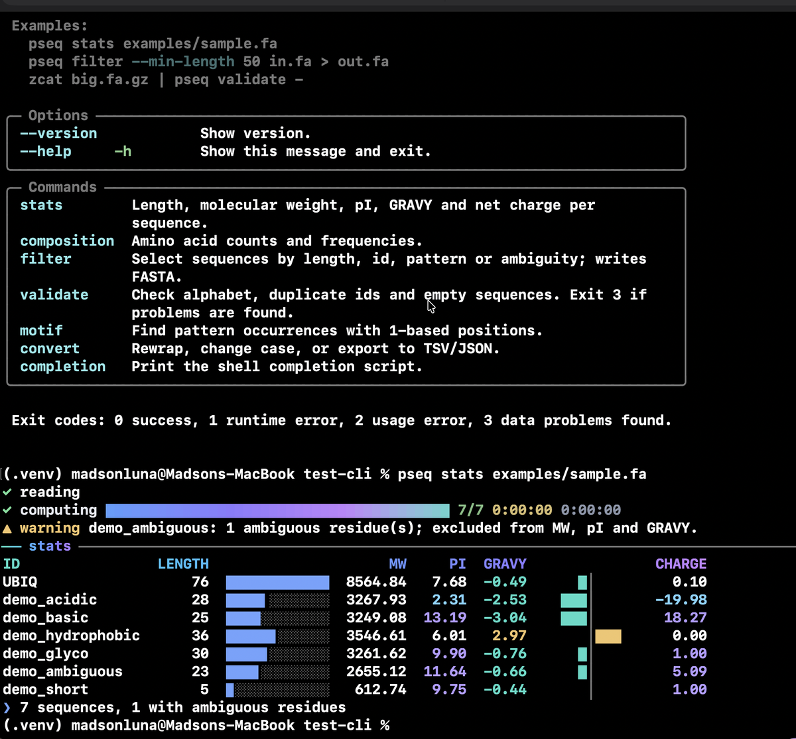

# cli-devops-with-ultimate-ui

A Claude skill for building and reviewing command line tools and terminal user
interfaces that are robust (pipe safe, CI safe, scriptable, typed, tested) and
visually excellent (animated teal to blue to violet gradients, spinners,
progress, panels, launchers, streaming output), in the style of Claude Code,
Gemini CLI, Crush and lazygit.

The two goals are not in tension. The same discipline that makes output pipe
safe is what lets visual polish be applied without breaking anything.

```
 ██████╗██╗     ██╗    ██████╗ ███████╗██╗   ██╗ ██████╗ ██████╗ ███████╗
██╔════╝██║     ██║    ██╔══██╗██╔════╝██║   ██║██╔═══██╗██╔══██╗██╔════╝
██║     ██║     ██║    ██║  ██║█████╗  ██║   ██║██║   ██║██████╔╝███████╗
██║     ██║     ██║    ██║  ██║██╔══╝  ╚██╗ ██╔╝██║   ██║██╔═══╝ ╚════██║
╚██████╗███████╗██║    ██████╔╝███████╗ ╚████╔╝ ╚██████╔╝██║     ███████║
 ╚═════╝╚══════╝╚═╝    ╚═════╝ ╚══════╝  ╚═══╝   ╚═════╝ ╚═╝     ╚══════╝
                    cli-devops-with-ultimate-ui
```

## Install

The package is a folder with `SKILL.md` at its root, the Agent Skills format,
which every agent below reads. One `make` target per destination:

| Agent | Command | Where it lands |
| --- | --- | --- |
| Claude Code | `make install` | `~/.claude/skills/cli-devops-with-ultimate-ui` |
| Codex | `make install-codex` | `~/.agents/skills/cli-devops-with-ultimate-ui` |
| Gemini CLI | `make install-gemini` | linked through `gemini skills link` |
| Claude.ai | `make package`, then upload | Settings, Capabilities, Skills, Upload skill |

```
make install          # Claude Code
make verify-install   # fails when the installed copy has drifted from this tree
make install-all      # Claude Code and Codex in one go
```

A skill that lives only in this repository is not available to any of them. If
an agent names the skill and then cannot load it, the installed copy is missing
or stale, and `make install` is the fix. `make verify-install` is what tells
the two apart.

### Codex

Codex searches, by scope: `$CWD/.agents/skills`, `$CWD/../.agents/skills`,
`$REPO_ROOT/.agents/skills`, `$HOME/.agents/skills`, `/etc/codex/skills`, then
its bundled set. `make install-codex` writes the home scope. For one repository
only, copy the folder into that repository's `.agents/skills/` instead.

### Gemini CLI

```
gemini skills link $(pwd)/skills/cli-devops-with-ultimate-ui   # tracks this tree
gemini skills install https://github.com/madsondeluna/skill-cli-devops-and-ui
gemini skills list
```

`link` follows the working tree, so an edit here is live in the next session;
`install` takes a copy from the git URL. `make install-gemini` runs the link
form.

### Antigravity

Antigravity reads the same `SKILL.md` format. Its bundled skills sit in
`~/.gemini/antigravity-cli/builtin/skills/`, one folder each, with the same
`name` and `description` frontmatter this package uses. Place the folder in the
skills directory your version reads, alongside the built-in set.

### Claude.ai

```
make package        # writes dist/cli-devops-with-ultimate-ui.skill
```

Settings, Capabilities, Skills, Upload skill.

Then ask for a CLI. The skill triggers on requests to create, review or polish
any command line tool, TUI, REPL, agent console, progress bar, banner, help
text or exit code handling, and on argument parser work in argparse, click,
typer, cobra, clap, commander or oclif.

## Two modes

**Build mode**, for a new tool: everything in the skill is a default to apply.

**Audit mode**, for a tool that already exists and works: the skill is a lens,
not a rewrite. It reads and runs, reports what could improve and what is
missing, and proposes patches the user chooses to apply. Working behavior is
treated as a specification even where the skill would have chosen otherwise,
because scripts and pipelines depend on it. Findings are ranked by what they
cost the user, and what was verified correct is stated explicitly.

## What is inside

The skill carries both halves of a command line tool. Behaviour: subcommand
shape, option syntax, defaults, prompts, help, error messages and exit codes,
streams and piping, TTY and CI, configuration precedence, accessibility,
testing, and an audit checklist. Appearance: the aurora theme, the vendorable
`ui.py`, banner, spinners, progress, panels, launcher, and a terminal hygiene
harness. They were two skills until they were merged; a tool needs both and
splitting them meant loading half an answer.


```
skills/cli-devops-with-ultimate-ui/
  SKILL.md                          modes, shapes, stack choice, workflow, rules, identity
  references/
    principles.md                   streams, capability detection, --json, help, exit codes, errors
    palette.md                      aurora identity: roles, WCAG contrast, gradient stops, glyphs
    anatomy.md                      banner, status, steps, progress, table, tree, panel, diff, footer
    motion.md                       latency ladder, sweep, spinners, progress, thinking indicator
    launcher.md                     filterable select list and keybinding footer
    interactive-tui.md              terminal modes, keyboard, mouse, layout, resize, accessibility
    agent-ui.md                     transcript, tool call cards, permission prompts, token footer
    engineering.md                  complexity, streaming, concurrency, security, core tests
    mcp-workflow.md                 command tree diagrams, API verification, decision records
    review-checklist.md             audit scenarios, checklist and report format
    stack-bash.md  stack-python.md  stack-typescript.md  stack-go.md  stack-rust.md
  scripts/
    check_cli.py                    pty harness: pipe, NO_COLOR, CI, help, version, json, usage, Ctrl-C
    palette.py                      swatches, WCAG table, Rich or Ink theme export, gradient stops
    demo_gallery.py                 reference tool built on the template
  assets/
    theme.json                      source of truth for roles, gradient, glyphs, box sets
    spinners.json                   curated spinner frames with ASCII fallbacks
    README-template.md              README skeleton with complexity, flags and exit code tables
    templates/python/ui.py          vendorable output module (Rich)
    templates/python/test_ui.py     its unit tests
    templates/python/font-shadow.json  ANSI Shadow glyph table, no runtime dependency
    templates/typescript/theme.ts   vendorable module for Ink
```

## Example

`examples/pseq/` is a working tool built from this skill: a protein FASTA
analyser with seven subcommands, colour by role, a gradient banner, a spinner
and a progress bar on stderr, bars that shrink with the window, plain TSV when
piped, and 34 tests including a pseudo terminal suite. It is the answer to
"what does a tool from this skill look like", and CI runs its tests and points
the hygiene harness at it on every push.

```
make example    # installs it in a temp venv, runs its tests and the harness
```

`pseq` with no command, and `pseq stats` on the sample file:





The vendored `ui.py` inside it is compared against the template on every run.
An example that has silently drifted from the thing it demonstrates is worse
than no example.

## Identity

Theme `aurora`: teal `#3DDBC7` into blue `#5B9CFF` into violet `#C084FC`,
interpolated in OKLCH so the midpoints do not go grey. Every text role clears
WCAG 4.5 to 1 on both dark and light backgrounds; the numbers are in
`references/palette.md` and recomputable with `make palette`.

The gradient is animated by hue phase at 15 fps and confined to one moving
surface at a time: the banner animates and freezes before any spinner or bar
begins cycling. Nothing static ever shimmers. Status colours keep conventional
hues and are always paired with a glyph or a word, so colour is never the only
channel.

## Robustness gates

Every tool built with this skill has to clear these, and the harness checks
most of them mechanically:

- The result goes to stdout; progress, spinners, prompts and errors to stderr.
- The environment is detected once at startup: TTY per stream, `NO_COLOR`,
  `FORCE_COLOR`, `CI`, `TERM=dumb`, width, colour depth. Plus
  `--color=auto|always|never`.
- `--json` with stable sorted keys on anything a script might consume.
- Exit codes 0, 1, 2 and 130, with `BrokenPipe` handled quietly.
- Frames written in one syscall inside DEC synchronized output, so tmux and
  SSH do not flicker. The cursor is always restored.
- Unknown commands and flags suggest the nearest valid name.
- Destructive confirmations state the count and what is irreversible.
- Complexity and memory stated before the loop is written, streaming by
  default, bounded buffers and bounded fan out, no shell interpolation.

## Development

```
make test      # unit tests for the vendorable template
make audit     # terminal hygiene harness against the demo tool
make demo      # render the gallery in this terminal
make palette   # palette and WCAG contrast table
make package   # build dist/cli-devops-with-ultimate-ui.skill
```

CI runs the tests, the harness and the house style check on Python 3.10 and
3.12. See CONTRIBUTING.md.

## License

MIT. The ANSI Shadow glyph table in `font-shadow.json` was generated from the
figlet font of the same name.
