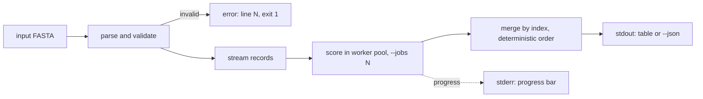

# toolname

One sentence saying what the tool does and for whom. No adjectives.

```
$ toolname run input.fa --jobs 8
```

## Install

```
uv tool install toolname        # or: pipx install toolname
```

Requires Python 3.10 or newer. No compiler, no system libraries.

## Usage

Lead with the three commands a new user actually runs, each with the output
they should expect:

```
$ toolname run input.fa
name            score  status
AMP_00417       0.94   ok
AMP_00418       0.71   ok

$ toolname run input.fa --json | jq '.records[] | select(.score > 0.9)'

$ toolname config set threads 8
```

## How it works

<!-- Diagram generated with the draw.io connector, exported as PNG or SVG into
docs/, with the Mermaid source kept below so it stays editable and diffable
even for readers who never open the connector. -->


<details>
<summary>Diagram source</summary>



</details>

## Performance

State the complexity and the memory bound. This is a contract, not a boast,
and writing it is how the accidental quadratic gets caught.

| Stage | Time | Memory |
|---|---|---|
| parse | O(n) in records | O(1), streamed line by line |
| score | O(n) in records, O(n/j) wall clock with j workers | O(chunk size) per worker |
| merge | O(n log n) to restore input order | O(n) in record ids only |

Measured: 2.1 million records in 4 minutes 12 seconds on 8 cores, peak
resident 380 MB. Input larger than memory is supported; output is written as
it is produced.

## Options

| Flag | Env | Default | Meaning |
|---|---|---|---|
| `--jobs N` | `TOOLNAME_JOBS` | CPU count | worker processes, 0 means auto |
| `--out PATH` | | stdout | write results to a file |
| `--json` | | off | machine readable output, stable keys |
| `--color WHEN` | `NO_COLOR` | auto | auto, always or never |
| `--dry-run` | | off | show what would happen, change nothing |
| `--verbose` | `TOOLNAME_DEBUG` | off | config provenance, peak memory, traces |

Precedence: flag, then environment variable, then `./toolname.toml`, then
`$XDG_CONFIG_HOME/toolname/config.toml`, then `/etc/toolname/config.toml`,
then built in defaults. `--verbose` prints which of these were found and which
layer each effective value came from.

## Exit codes

| Code | Meaning |
|---|---|
| 0 | success |
| 1 | the operation failed (bad input, IO error, failed step) |
| 2 | usage error (unknown flag, missing argument) |
| 130 | interrupted with Ctrl-C |

## Output

The result goes to stdout; progress, warnings and errors go to stderr, so
`toolname run x | jq` and `toolname run x > out.tsv` both behave. Color is
disabled automatically when stdout is not a terminal and whenever `NO_COLOR`
is set.

## Theme

Colors and glyphs come from `$XDG_CONFIG_HOME/toolname/theme.json`, keyed by
role (`accent`, `ok`, `warn`, `err`, `muted`). Set `TOOLNAME_ASCII=1` for a
terminal without Unicode, `TOOLNAME_NO_ANIMATION=1` to freeze the indicators.

## Security

Note what the tool executes, what it writes, and what it sends over the
network, in three lines. If it runs nothing, writes only to the paths given
and makes no network calls, say exactly that: it is the most reassuring
paragraph in the file.

## License

MIT
